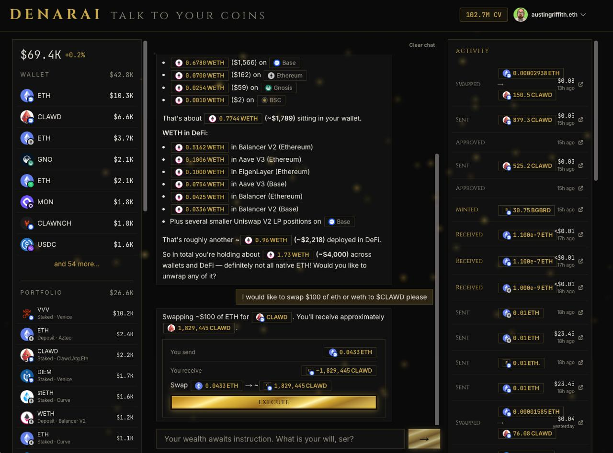

# Denarai — Talk to Your Coins

A conversational AI wallet interface. Connect your wallet, talk to your coins.



## What it does

Type anything — "how is ETH doing?", "swap 100 USDC to ETH", "show my recent trades" — and Denarai handles it through natural language.

- **Portfolio view** — see your assets and balances at a glance
- **Natural language intents** — AI parses your words into on-chain actions
- **Multi-step transactions** — bridges, swaps, wraps, unwraps
- **DeFi actions** — powered by LI.FI for cross-chain routing

## Access

Denarai requires a CV (Clawdviction) balance on [larv.ai](https://larv.ai). Earn CV by staking $CLAWD. Sign once with your wallet — that's it. Each chat message costs 25,000 CV.

## Stack

- Next.js + RainbowKit + Wagmi + Viem
- [LI.FI](https://li.fi) — cross-chain swaps and bridges
- [Zerion](https://zerion.io) — portfolio data
- [Alchemy](https://alchemy.com) — onchain data
- [Venice.ai](https://venice.ai) — private AI inference
- Anthropic Claude — intent parsing

## Live

[denar.ai](https://denar.ai)

## Setup

```bash
yarn install
```

Create `packages/nextjs/.env.local`:
```
ANTHROPIC_API_KEY=
NEXT_PUBLIC_ALCHEMY_API_KEY=
ZERION_API_KEY=
LIFI_API_KEY=
VENICE_API_KEY=
```

```bash
yarn start
```

Visit `http://localhost:3000`

## License

MIT
